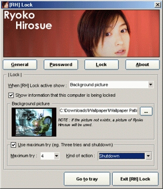



## \[RH\] Lock : Screen locking \[Reuploaded\]

### Description

This is my latest project, not my best and biggest though. I code this between my spare time. [RH] Lock is a screen-locking app, not like the other screen-locking apps. [RH] Lock looks like a commercial programs [ready to use, just compile it and run the EXE file], better and more features [such as multi-password, and selectable background]. My codes are simple, and I'm sure you'll understand 'em in no time. I use some OCX, and DLL from PSC because I'm lazy to write my own OCX [because I don't have enough time for that]. Also some codes from PSC, such as TextEncryption [I forgot the author], WriteReadRegistry [I forgot the author]. Because I'm going to upload this program as a FREEWARE program [at download.com, or tucows.com] I'll change the registry encryption and [maybe] more features :). I want to hear about your comment, suggestion, or critics. You can vote for me if you want to or if you think I deserves it. Anyway, just enjoy my program... I re-uploaded this program because on my previous submission some file was deleted. Yes, I'm new to this PSC... and this is my first submission. I've heard some license file are missing, but if you've downloaded Page Creator 3 [also from PSC] there's an ocx called prjChameleon.ocx... Maybe the license also inside the Page Creator 3 package. :)
 
### More Info
 

             |
---                |---
**Submitted On**   |2002-04-21 00:48:26
**By**             |[Ariel825010106](https://github.com/Planet-Source-Code/PSCIndex/blob/master/ByAuthor/ariel825010106.md)
**Level**          |Advanced
**User Rating**    |4.3 (100 globes from 23 users)
**Compatibility**  |VB 6\.0
**Category**       |[Complete Applications](https://github.com/Planet-Source-Code/PSCIndex/blob/master/ByCategory/complete-applications__1-27.md)
**World**          |[Visual Basic](https://github.com/Planet-Source-Code/PSCIndex/blob/master/ByWorld/visual-basic.md)
**Archive File**   |[\[RH\]\_Lock\_747944232002\.zip](https://github.com/Planet-Source-Code/ariel825010106-rh-lock-screen-locking-reuploaded__1-34059/archive/master.zip)

